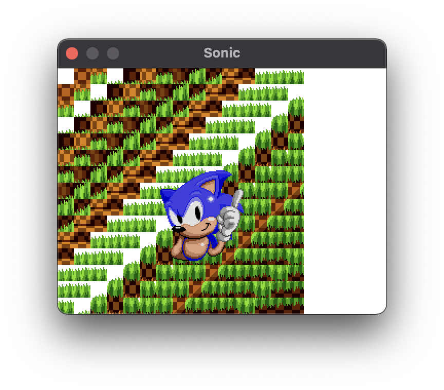

# Sonic

Reverse engineered Sonic, but building a new, entirely open, moddable engine instead of RSDK.

## Goals
- Pure rust Sonic implementation with fewest dependencies possible
- Run anywhere cargo builds (baseline software pixel framebuffer engine)
- Emphasis on open formats, clear code, extensibility, and modding
- Fastest, lowest resource open Sonic implementation ever

**You'll need a retail sonic to extract the assets.**

## Why?
- Learn how sonic was built and perhaps improve upon and extend its design.
- A starting point for sonic modders or someone wanting to create a retro style game.
- Research adapting older game architecture to rust.

## Progress
- [ ] RSDKv3
- [x] RSDKv4 archives
  - [x] Unpacking
  - [x] Decryption
  - [ ] Processing of assets (.bin -> .json)
    - [x] GlobalConfig.bin
    - [ ] StageConfig.bin
    - [ ] Act<x>.bin
- [ ] RSDKv5
- [ ] Basic game engine
  - [ ] Software Renderer (minifb)
  - [ ] Hardware Renderer (pixel)
  - [ ] Audio
- [ ] Sonic 1
- [ ] Sonic 2
- [ ] Sonic CD

<p></p>

## RSDK Extractor

Tested with following `Data.rsdk` files (md5 sum):

```
MD5                               Size      Origin
2881d2492be3ba5d3b6106cdbf82c3e5  38198396  Sonic the Hedgehog Classic apk v3.7.0
```

Here's some arweave txids:

```
Release     Arweave TXID
Sonic 1     nwwbTljMYHScY6fgbQkuNdH5127wAidBYrCH9w8dpAk
```

```bash
cargo run --package rsdk-extract -- <file>
```

### Why?

Because for some reason Sonic reversers publish weird windows code and I don't really want to touch it with a 10 foot clownpole.

## Installing / Playing

```bash
cargo run
```

## Resources

- https://www.lucianociccariello.com/research/sonicmania
- http://unhaut.epizy.com/retrun/sonic2013.html
